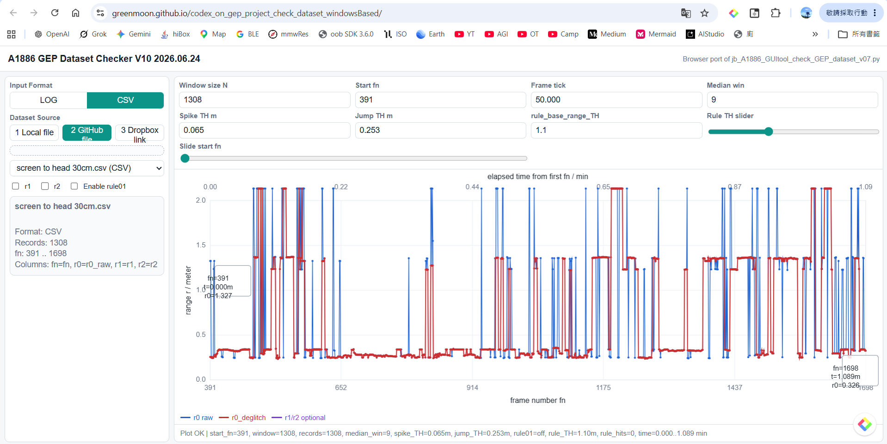
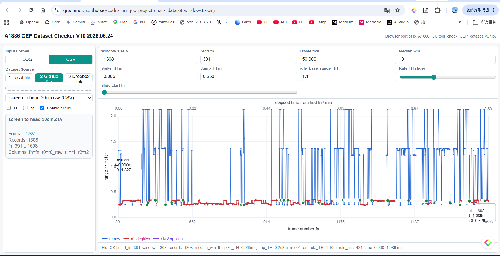
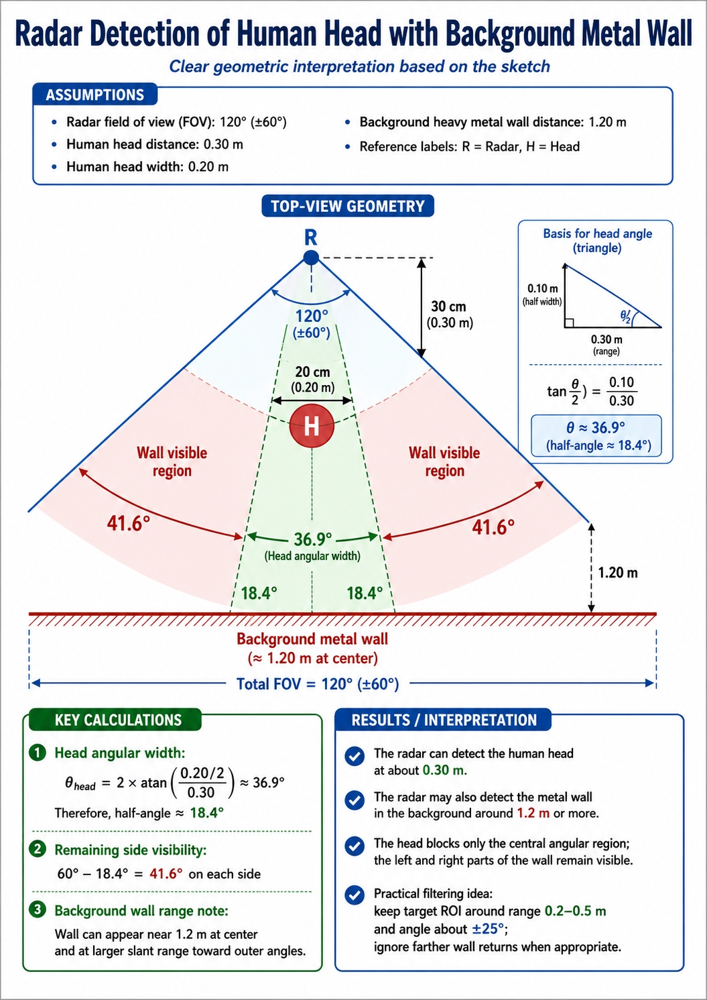

# A1886 規則比較報告 v07

**檔案名稱：** `jb_A1886_screentohead30cm_deglitch_rule01_report_v07_TC.md`  
**測試資料：** `screen to head 30cm.csv`  
**比較項目：** `run deglitch` vs `run deglitch + rule01`  
**公司：** Joybien Technologies  
**版本：** v07 TC  

---

## 1. 報告目的

本報告依據 A1886 GEP Dataset Checker V10 畫面，針對 `screen to head 30cm.csv` 進行兩種處理方式比較：

1. **run deglitch**：只執行 r0 去毛刺處理，未啟用 rule01。
2. **run deglitch + rule01**：先執行 r0 去毛刺，再啟用 rule01 做第二層規則檢查。

目的為確認：

- `deglitch` 是否能降低 `r0_raw` 的短暫尖峰。
- `rule01` 開啟後，是否可進一步標示可疑區段與統計 rule hit。
- 針對人體頭部與背景金屬牆同時存在的場景，說明為何曲線上可能出現兩個可能 range 值。

---

## 2. 測試資料與共同參數

| 項目 | 設定值 |
|---|---:|
| Input format | CSV |
| 檔案 | `screen to head 30cm.csv` |
| Records | 1308 |
| fn 範圍 | 391 .. 1698 |
| Window size N | 1308 |
| Start fn | 391 |
| Frame tick | 50.000 ms/frame |
| Median win | 9 |
| Spike TH m | 0.065 |
| Jump TH m | 0.253 |
| rule_base_range_TH | 1.1 m |

---

## 3. 左圖：run deglitch（rule01 關閉）

說明：此圖僅執行 `deglitch`，`rule01` 未開啟。狀態列顯示：

```text
rule01=off, rule_hits=0
```



**圖 1．run deglitch 畫面。**  
紅色 `r0_deglitch` 已可降低部分藍色 `r0_raw` 尖峰影響，但仍可看到多個高值跳動區段。

---

## 4. 右圖：run deglitch + rule01（rule01 開啟）

說明：此圖啟用 `rule01`，綠色點為 rule hit 標示。狀態列顯示：

```text
rule01=on, rule_hits=424
```



**圖 2．run rule01 畫面。**  
`rule01` 開啟後，可在原本 `deglitch` 的基礎上，額外標示與統計可疑點。

---

## 5. 主要觀察

- 兩張圖使用相同資料與相同 deglitch 參數，因此可直接比較 `rule01` 開啟前後差異。
- 只執行 `deglitch` 時，紅色 `r0_deglitch` 已可降低部分 `r0_raw` 尖峰影響。
- 啟用 `rule01` 後，系統額外標示規則命中點；本次畫面顯示 `rule_hits = 424`。
- `rule01` 可作為第二層檢查，用於標示與統計可疑區段，利於後續條件調整。

---

## 6. 差異摘要

| 比較項目 | run deglitch | run rule01 |
|---|---:|---:|
| Enable rule01 | 關閉 | 開啟 |
| rule01 狀態 | `rule01=off` | `rule01=on` |
| rule_hits | 0 | 424 |
| 額外標記 | 無綠色 rule hit 標記 | 有綠色 rule hit 標記 |
| 用途 | 觀察基本去毛刺效果 | 在去毛刺後再加入 rule01 規則檢查 |

---

## 7. 補充說明：為何曲線上可能同時出現兩個 range 值

下圖提供幾何與反射強度的概念說明，用來解釋為何在某些量測曲線上，系統可能同時或交替報告兩個可能的 range 值。



**圖 3．人頭與背景金屬牆的幾何示意圖。**  
此圖用於說明為何較近的人頭與較遠的金屬牆都可能形成可見回波。

---

## 8. 物理解釋與對應到曲線的原因

當前方有人頭、後方又有大型金屬牆時，雷達在視場角（FOV）內可能同時接收到兩類回波：

1. **較近的人頭回波**：距離較近，但人體頭部的雷達散射截面（RCS）可能較小。
2. **較遠的背景金屬牆回波**：距離較遠，但金屬牆 / 鉛牆的 RCS 可能較大。

幾何上，人頭只遮住中央部分角度；左右兩側仍有一部分背景牆面保持可見，因此背景牆回波不一定會完全消失。

因此在曲線或候選 range 輸出中，就可能出現兩個可能的距離值：

- 一個較近，對應人頭或近端目標。
- 一個較遠，對應背景金屬牆或多路徑反射。

若人頭 RCS 較小，而背景金屬牆 RCS 較大，則即使牆面距離更遠，其回波仍可能相當強，甚至在部分 frame 中比人頭回波更容易被選成 candidate peak。

---

## 9. 與本報告的關聯

- 曲線上出現多個高值 / 遠值候選，不一定完全是 random noise，也可能是背景金屬牆的真實回波。
- `deglitch` 可先處理短暫尖峰。
- `rule01` 可作為第二層條件，用來進一步標示與統計可疑區段。
- 若應用目標是優先偵測前方人頭，可考慮搭配：
  - range ROI
  - angle ROI
  - previous-valid hold
  - target-priority rule

這些方法可降低背景金屬牆回波被誤選為主要距離值的機率。

---

## 10. 結論

依據本次 `screen to head 30cm.csv` 的 V10 畫面比較，`deglitch` 可先降低 `r0_raw` 的部分尖峰；在此基礎上再開啟 `rule01`，可進一步標示與統計可疑點。

本次 `rule01` 觸發：

```text
rule_hits = 424
```

因此，`rule01` 適合用來分析可疑點分布，作為後續 `rule_base_range_TH` 或其他規則條件調整的依據。

---

## 11. 建議

- 若目標是觀察基本平滑效果，可先使用 `run deglitch`。
- 若目標是檢查可疑區段與規則命中，建議啟用 `run rule01`。
- 後續可依 `rule_hits` 數量與命中位置，微調 `rule_base_range_TH` 或加入更細的條件分層。
- 若場景中存在背景金屬牆，建議將 rule-based filtering 與幾何 / RCS 觀點一起考慮，而不是只把所有遠距離 peak 視為 random glitch。

---

## 12. Repo push 建議

建議 repo 內放置：

```text
reports/
  jb_A1886_screentohead30cm_deglitch_rule01_report_v07_TC.md
  jb_A1886_screentohead30cm_deglitch_rule01_report_v07_TC_assets/
    run_deglitch_rule01_off.png
    run_rule01_on.png
    radar_head_wall_geometry.jpeg
```

---

**Joybien Technologies**  
`jb_A1886_screentohead30cm_deglitch_rule01_report_v07_TC.md`
